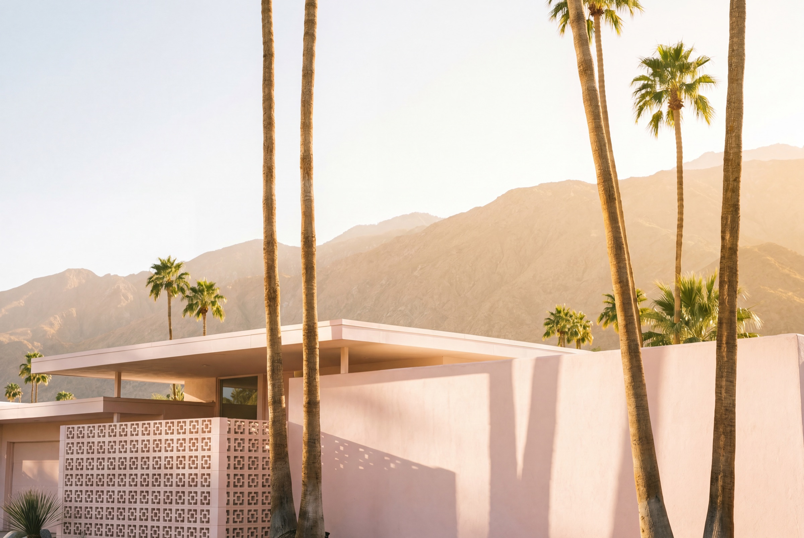
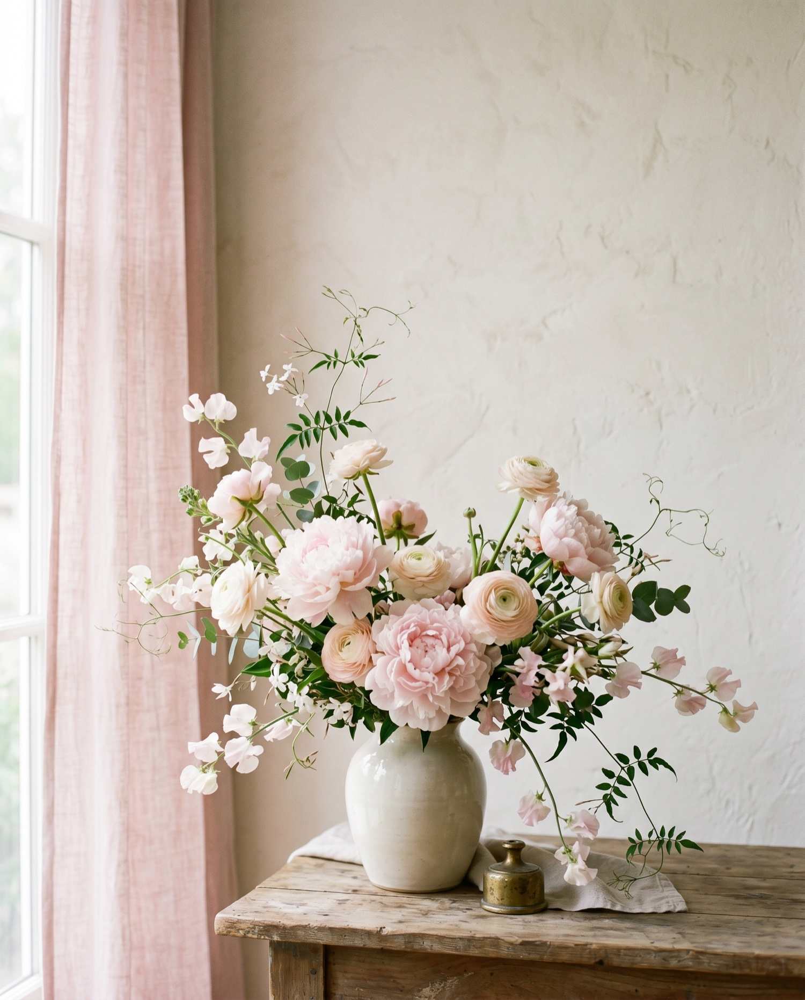
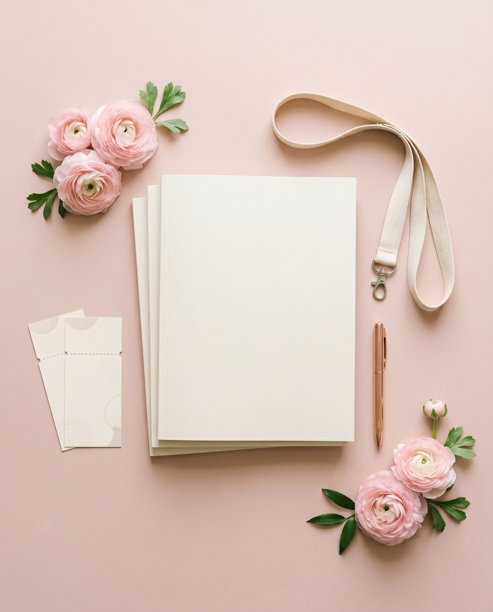
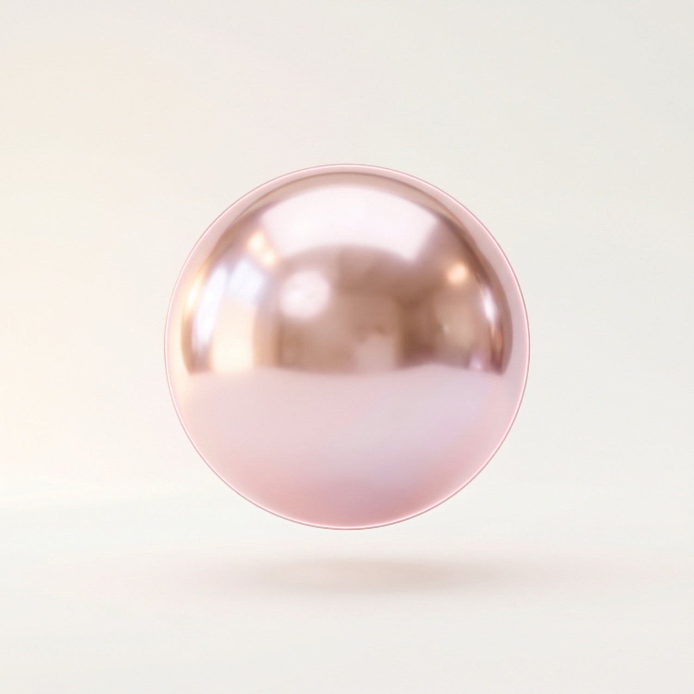
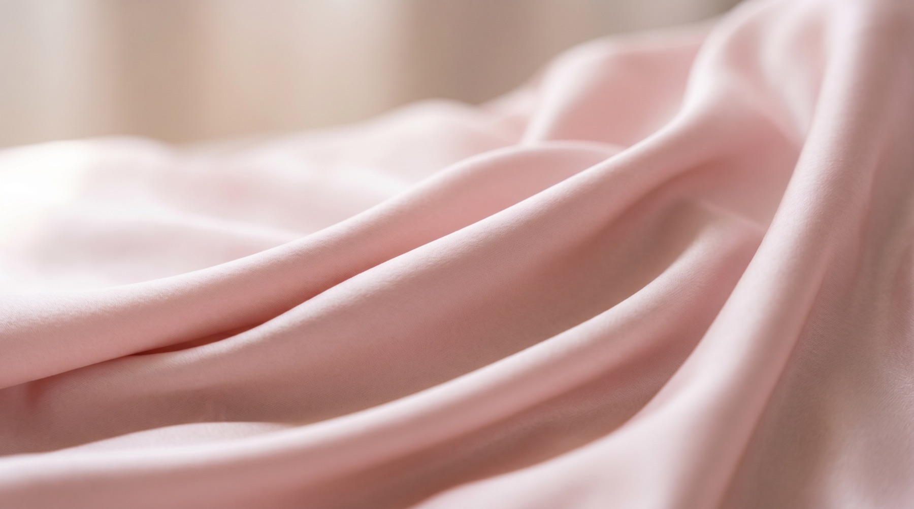
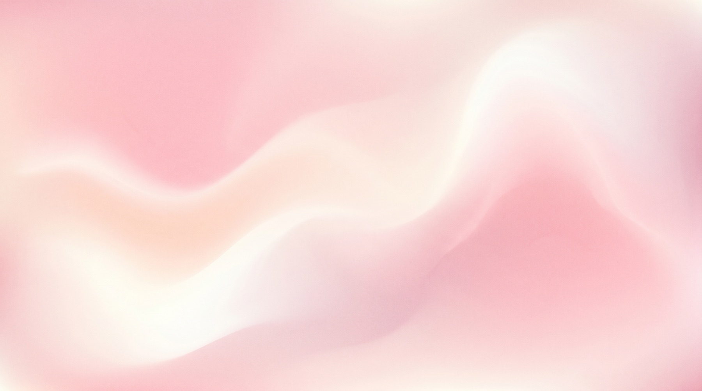
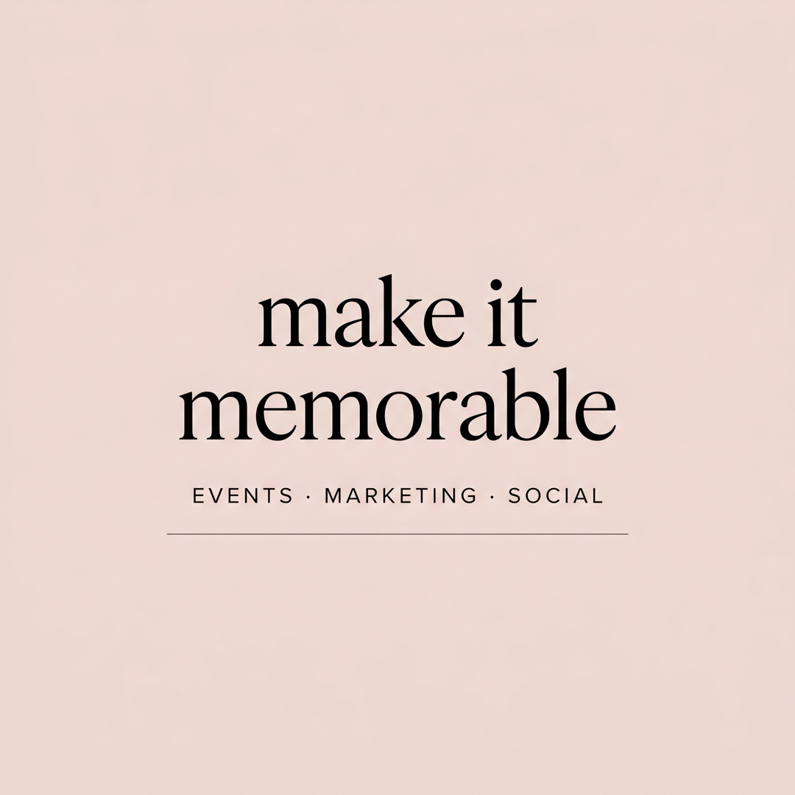
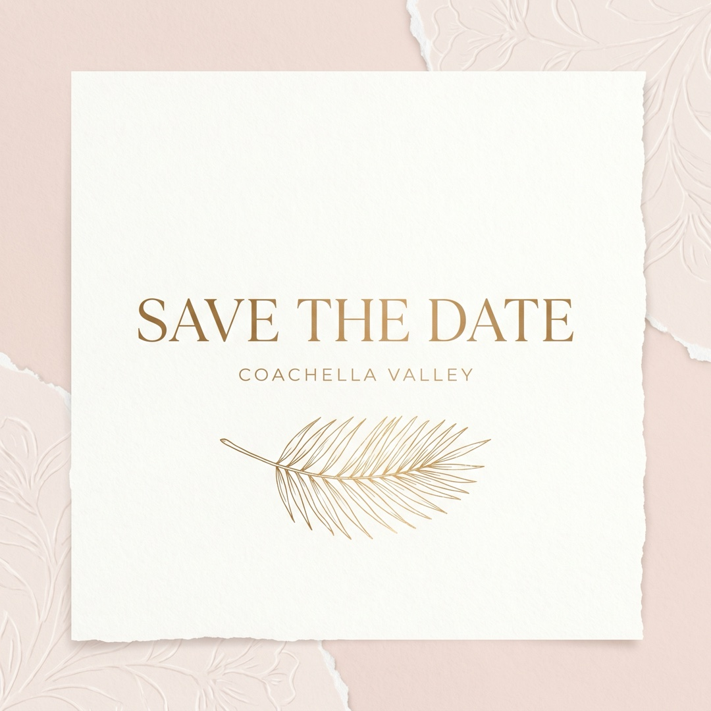
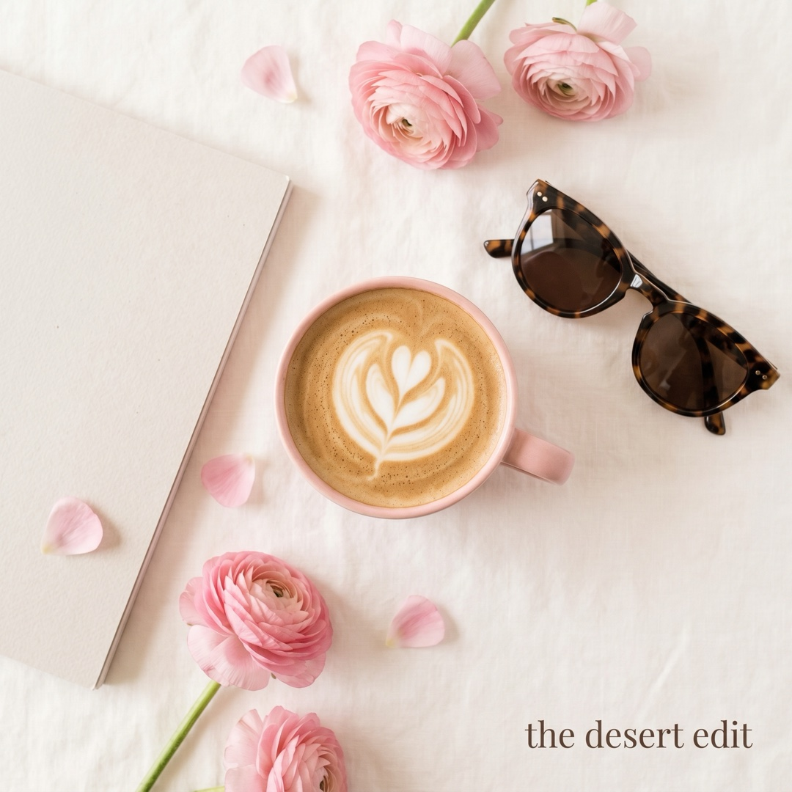

# Image Generation Log — Alexandria Rosales

All media generated via the **Higgsfield MCP** (forge skill), 2026-06-23. Models routed by the
server: `recraft_v4_1` (vector), `nano_banana_2` / `nano_banana_flash` (photoreal), Nano Banana
Pro requested for text/4K slots. **Plan: Ultra — 0 credits deducted** (generation is effectively
unlimited; credit *equivalents* from `get_cost` shown for reference). No legacy Grok/Gemini tier used.

**Accuracy guardrail:** no portrait/likeness of Alexandria and no specific real business was
generated — every asset is abstract / atmospheric / editorial filler (see ACCURACY.md).

---

### #1 — monogram-ar-v2.svg ✓ USED (favicon + mark)

- Model: `recraft_v4_1` (vector) · ~1 cr-eq · **Attempt 2/2**
- Slot: AR monogram → `favicon.png` / `favicon-512.png` + selector mark
- Claude review: 9/10. v1 (`-rejected-v1`) had an odd accent shape; v2 is a clean Didot interlock.

### #2 — hero.jpg ✓ USED (Direction A hero + OG)

- Model: `nano_banana_2` @ 4K (5056×3392) · ~4 cr-eq · Attempt 1/1
- Slot: Direction A cover image + `og.jpg` / `og-masthead.jpg`
- Claude review: 10/10. Palm Springs desert-modern facade, palms, San Jacinto range, golden light. Region-accurate, no real building.

### #3 — florals.jpg ✓ USED (portrait stand-in, both directions)

- Model: `nano_banana_flash` @ 2K · ~1 cr-eq · Attempt 1/1
- Slot: "portrait" slot (intentional stand-in until Alex provides a headshot)
- Claude review: 9/10. Editorial pink florals, no face — honest placeholder.

### #4 — flatlay.jpg ✓ USED (texture/atmosphere)

- Model: `nano_banana_flash` @ 2K · ~1 cr-eq · Attempt 1/1
- Slot: press/marketing still-life — available for future sections. Blank props, no branding.

### #5 — paper.jpg ✓ USED (section texture)
- Model: `nano_banana_flash` @ 2K · ~1 cr-eq · **Attempt 2/2** (first attempt failed server-side, no charge)
- Slot: blush paper grain for editorial backgrounds.

### #6 — orb.jpg ✓ USED (Direction B hero object + selector)

- Model: `nano_banana_flash` @ 2K · ~2 cr-eq · **Attempt 3/3** (two 4K Nano-Banana-Pro attempts failed server-side, no charge; 2K succeeded)
- Slot: floating glossy sphere, Direction B bento + selector Direction-B card.
- Claude review: 10/10. Pearlescent chrome-pink, soft studio light.

### #7 — silk.jpg ✓ USED (texture, available)

- Model: `nano_banana_flash` @ 2K · ~1 cr-eq · Attempt 1/1
- Slot: blush silk macro — texture tile for future use.

### #8 — mesh.jpg ✓ USED (ambient glow)

- Model: `nano_banana_flash` @ 2K · ~1 cr-eq · Attempt 1/1
- Slot: art-directed soft pink aurora mesh — ambient/hero glow source. The "good" gradient, not slop.

### #9 — social-1.jpg ✓ USED (social showcase, both directions)

- Model: `nano_banana_2` @ 2K · ~1 cr-eq · Attempt 1/1
- Slot: social tile — "make it memorable / EVENTS · MARKETING · SOCIAL". Also cropped → `og-soft.jpg`.
- Claude review: 10/10. In-image text crisp + correctly spelled.

### #10 — social-2.jpg ✓ USED (social showcase)

- Model: `nano_banana_2` @ 2K · ~1 cr-eq · Attempt 1/1
- Slot: social tile — "SAVE THE DATE · Coachella Valley" on deckle-edge paper with gold palm frond.
- Claude review: 10/10.

### #11 — social-3.jpg ✓ USED (social showcase)

- Model: `nano_banana_2` @ 2K · ~1 cr-eq · **Attempt 2/2**
- Slot: lifestyle flat-lay — "the desert edit". v1 (`-rejected-vogue`) rendered a real VOGUE cover; v2 is unbranded.
- Claude review: 10/10.

---

## Tallies
- **Jobs submitted:** 13 (11 planned + 2 regens). **Used:** 11. **Archived/superseded:** 2 (monogram v1, lifestyle v1). **Server failures (no charge):** 3 (paper v1, two 4K orb attempts).
- **Actual cost:** **$0.00** — Ultra plan, 0 credits deducted. (Sum of credit-equivalents ≈ 16, well under any cap.)
- **Within all cost safeguards.** No Grok/Gemini/OpenAI tier touched.

## QA notes
Every used asset passed Claude visual review ≥9/10 (no Grok-vision second pass needed — these are
abstract/editorial, low artifact-risk, and were eyeballed individually). In-image text on the three
social tiles verified crisp and correctly spelled.
